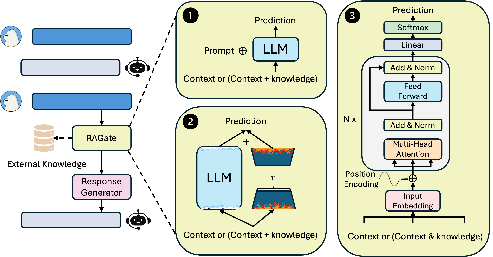

# RAGate: Adaptive Retrieval-Augmented Generation for Conversational Systems
<p align="center">
  
</p>

This repository includes the code and resources for our paper entitled "Adaptive Retrieval-Augmented Generation for Conversational Systems" for reproducible findings.
<div align="center">
  
  [](https://pytorch.org/)
  [](https://opensource.org/licenses/MIT)
</div>
  
## Full Data Generation
RAGate leverages the KETOD dataset, which extends the Google SGD dataset with additional human labels on adaptive knowledge augmentation with external knowledge.
To generate the full KETOD dataset, run gen_ketod_data.py from the [src](src) folder.
```
  python gen_ketod_data.py 
```

## Knowledge Retrieval Model Development
RAGate implements two retrieval models (TF-IDF and BERT/RoBERTa-ranker). 
It is required to first process the generated data into proper structures for knowledge retrieval. 
If BERT/RoBERTa-ranker is used, you need to train a ranking model after that. The example procedure is as follows:

```
- go to src/kg_select
- python process_data.py --data train.py / dev.py / test.py
- python train.py (update config.py if needed)
```
We share the trained BERT-ranker, which can be downloaded via the following link: [trained-ranker](https://drive.google.com/drive/folders/1LSg71IicaLCwjOVFPcJeBanMNl7zTvS-?usp=drive_link)

The evaluation of the ranking model with recall@1 and @3 can be conducted as follows:
```
  python generate_test.py
  python evaluate_test.py --result_repo [the location of the prediction outputs]
```

## Develop Base Response Generator (SimpleTOD)
To use the retrieved knowledge snippets and train a response generator, it is necessary to further process the data into certain structures in the following order: 

```
- go to src/simpletodplus
- python gen_kg_train.py (update the paths to the correct prediction file locations)
- python gen_data.py --data train/dev/test_retrieved.json 
```
Next, you can train a knowledge-enriched SimpleToD model by using the _run_simpletod.sh_ script to run _train_simpletod.py_ with configurations.
We also share the checkpoint of our trained model to reproduce our experimental findings [learned simpleToD](https://drive.google.com/drive/folders/1iSzkddWEQbBj-0CQXyJvQNjRzPFC3kmM?usp=drive_link) 

You can also use the _run_simpletod.sh_ to run the _test_simpletod_simple.py_ for testing with the steps included at the end of the test_simpletod_simple.py. 

## Explore the use of RAGate variants and evaluation
To explore the development of RAGate variants, it is essential to first aggregate the relevant knowledge according to the trained retriever:  
- use the _res_dialog_ files that store the predictions after running _generate_test.py_.
- run _aggregate_top_knowledge.py_ to collect top relevant knowledge snippets and combine them with the dialogue data.
- run _data_prepare_for_ragate.py_ to generate data using different instructions for later model fine-tuning.

Then, the development and evaluation of RAGate variants can be accessed in the src/RAGate folder:
- files starting with _classify_ are for training or finetuning model for RAGate.
- Then, RAGate-MHA.py and RAGate-llama.py are used to generate predictions.
- The _src/RAGate/result_analysis_ includes files about various evaluation aspects.

<!-- We also release the checkpoints for trained RAGate-MHA and RAGate-llama via download checkpoints or access via huggingface.

RAGate Variant | Link 
--- | ---
RAGate-llama (ctx-(syn-resp)-ner) | [XiWangEric/IfAug_classification_context_system_syn_res_ner_input_llama2_7b](https://huggingface.co/XiWangEric/IfAug_classification_context_system_syn_res_ner_input_llama2_7b)
RAGate-llama (ctx-(syn-resp)-ner-know) | [XiWangEric/IfAug_classification_context_system_syn_res_ner_know_input_llama2_7b](https://huggingface.co/XiWangEric/IfAug_classification_context_system_syn_res_ner_know_input_llama2_7b)
RAGate-llama (ctx-(syn-resp)-ner-source) | [XiWangEric/IfAug_classification_context_system_syn_res_ner_know_source_input_llama2_7b](https://huggingface.co/XiWangEric/IfAug_classification_context_system_syn_res_ner_know_source_input_llama2_7b)
RAGate-llama (ctx-(syn-resp)) | [XiWangEric/IfAug_classification_system_context_syn_res_input_llama2_7b](https://huggingface.co/XiWangEric/IfAug_classification_system_context_syn_res_input_llama2_7b)
RAGate-llama (ctx-only) | [XiWangEric/IfAug_classification_system_context_input_llama2_7b](https://huggingface.co/XiWangEric/IfAug_classification_system_context_input_llama2_7b)
RAGate-MHA (ctx-only) | [checkpoint](https://drive.google.com/file/d/1WdEXp1rHl2zyG8CmOwLxE4ViP4v8d6lF/view?usp=drive_link)
--!>


